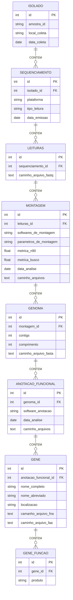

```mermaid
erDiagram
    ISOLADO ||--o{ SEQUENCIAMENTO : CONTEM
    SEQUENCIAMENTO ||--o{ LEITURAS : CONTEM
    LEITURAS ||--o{ MONTAGEM : CONTEM 
    MONTAGEM ||--o{ GENOMA : CONTEM
    GENOMA ||--o{ ANOTACAO_FUNCIONAL : CONTEM
    ANOTACAO_FUNCIONAL ||--o{ GENE : CONTEM
    GENE ||--o{ GENE_FUNCAO : CONTEM

    ISOLADO {
      int id PK
      string amostra_id
      string local_coleta
      date data_coleta
    }

    SEQUENCIAMENTO {
      int id PK
      int isolado_id FK
      string plataforma
      string tipo_leitura
      date data_emissao
    }

    LEITURAS {
      int id PK
      int sequenciamento_id FK
      text caminho_arquivo_fastq
    }

    MONTAGEM {
      int id PK
      int leituras_id FK
      string softwares_de_montagem
      string parametros_de_montagem
      float metrica_n90
      float metrica_busco
      date data_analise
      text caminho_arquivos
    }

    GENOMA {
      int id PK
      int montagem_id FK
      int contigs
      int comprimento
      text caminho_arquivo_fasta
    }

    ANOTACAO_FUNCIONAL {
      int id PK
      int genoma_id FK
      string software_anotacao
      date data_analise
      text caminho_arquivos
    }

    GENE {
      int id PK
      int anotacao_funcional_id FK
      string nome_completo
      string nome_abreviado
      string localizacao
      text camanho_arquivo_fna
      text caminho_arquivo_faa
    }
    GENE_FUNCAO{
      int id PK
      int gene_id FK
      string produto
    }
```