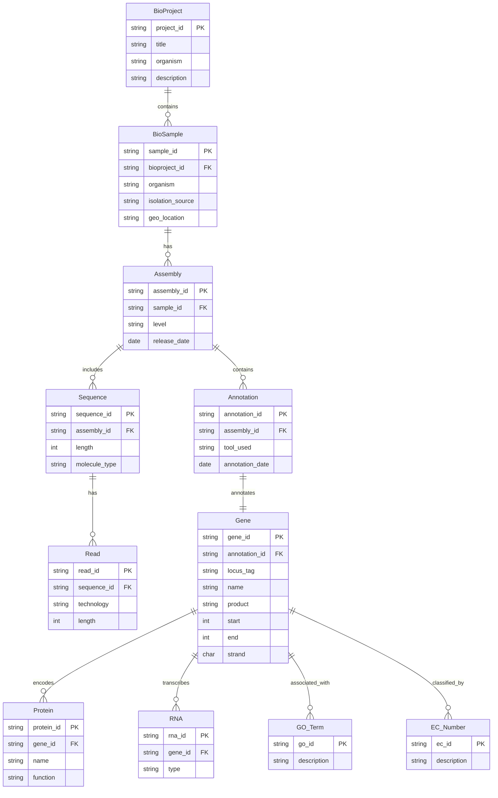

```mermaid

erDiagram
    BioProject ||--o{ BioSample : contains
    BioSample ||--o{ Assembly : has
    Assembly ||--o{ Sequence : includes
    Assembly ||--o{ Annotation : contains
    Sequence ||--o{ Read : has
    Annotation ||--|| Gene : annotates
    Gene ||--o{ Protein : encodes
    Gene ||--o{ RNA : transcribes
    Gene ||--o{ GO_Term : associated_with
    Gene ||--o{ EC_Number : classified_by

    BioProject {
        string project_id PK
        string title
        string organism
        string description
    }

    BioSample {
        string sample_id PK
        string bioproject_id FK
        string organism
        string isolation_source
        string geo_location
    }

    Assembly {
        string assembly_id PK
        string sample_id FK
        string level
        date release_date
    }

    Sequence {
        string sequence_id PK
        string assembly_id FK
        int length
        string molecule_type
    }

    Annotation {
        string annotation_id PK
        string assembly_id FK
        string tool_used
        date annotation_date
    }

    Gene {
        string gene_id PK
        string annotation_id FK
        string locus_tag
        string name
        string product
        int start
        int end
        char strand
    }

    Protein {
        string protein_id PK
        string gene_id FK
        string name
        string function
    }

    RNA {
        string rna_id PK
        string gene_id FK
        string type
    }

    Read {
        string read_id PK
        string sequence_id FK
        string technology
        int length
    }

    GO_Term {
        string go_id PK
        string description
    }

    EC_Number {
        string ec_id PK
        string description
    }
```