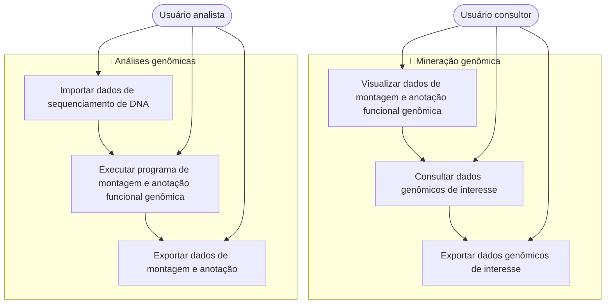

```mermaid
graph TD
  User1([Usuário analista])
  User2([Usuário consultor])

  subgraph MG[🔬Mineração genômica]
      A[Visualizar dados de montagem e anotação funcional genômica] --> S[Consultar dados genômicos de interesse] --> F[Exportar dados genômicos de interesse]
  end

  subgraph AG[🧬 Análises genômicas]
      Q[Importar dados de sequenciamento de DNA] --> W[Executar programa de montagem e anotação funcional genômica] --> R[Exportar dados de montagem e anotação]
  end

  User1 --> Q
  User1 --> W
  User1 --> R
    
  User2 --> A
  User2 --> S
  User2 --> F
```