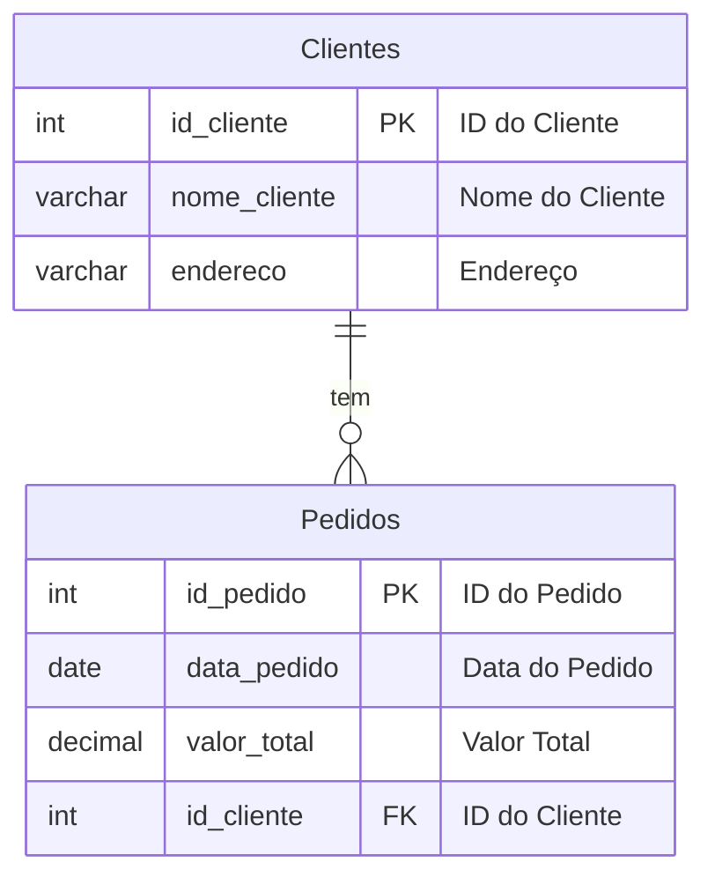

```mermaid
erDiagram
    Clientes ||--o{ Pedidos : "tem"
    Clientes {
        int id_cliente PK "ID do Cliente"
        varchar nome_cliente "Nome do Cliente"
        varchar endereco "Endereço"
    }
    Pedidos {
        int id_pedido PK "ID do Pedido"
        date data_pedido "Data do Pedido"
        decimal valor_total "Valor Total"
        int id_cliente FK "ID do Cliente"
    }
```