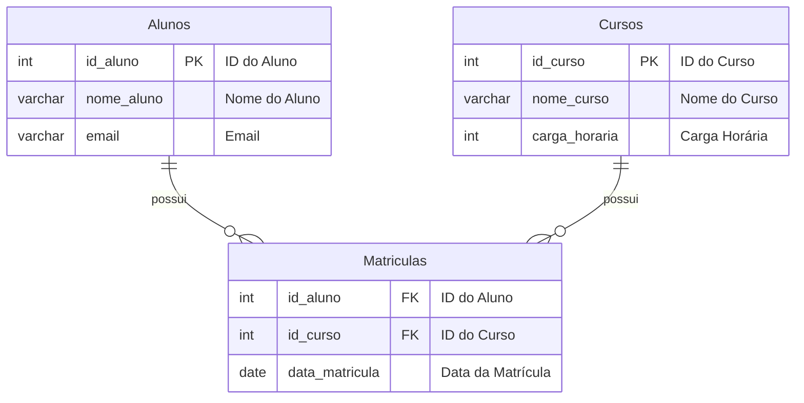

```mermaid
erDiagram
    Alunos ||--o{ Matriculas : "possui"
    Cursos ||--o{ Matriculas : "possui"

    Alunos {
        int id_aluno PK "ID do Aluno"
        varchar nome_aluno "Nome do Aluno"
        varchar email "Email"
    }
    Cursos {
        int id_curso PK "ID do Curso"
        varchar nome_curso "Nome do Curso"
        int carga_horaria "Carga Horária"
    }
    Matriculas {
        int id_aluno FK "ID do Aluno"
        int id_curso FK "ID do Curso"
        date data_matricula "Data da Matrícula"
    }
```