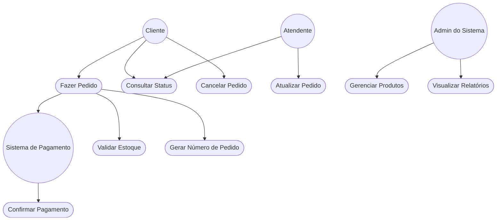

```mermaid
graph TD
  Cliente((Cliente))
  Atendente((Atendente))
  Pagamento((Sistema de Pagamento))
  Admin((Admin do Sistema))

  FazerPedido([Fazer Pedido])
  ConsultarStatus([Consultar Status])
  CancelarPedido([Cancelar Pedido])
  AtualizarPedido([Atualizar Pedido])
  GerenciarProdutos([Gerenciar Produtos])
  VisualizarRelatorios([Visualizar Relatórios])
  ValidarEstoque([Validar Estoque])
  ConfirmarPagamento([Confirmar Pagamento])
  GerarNumeroPedido([Gerar Número de Pedido])

  Cliente --> FazerPedido
  Cliente --> ConsultarStatus
  Cliente --> CancelarPedido

  Atendente --> ConsultarStatus
  Atendente --> AtualizarPedido

  Admin --> GerenciarProdutos
  Admin --> VisualizarRelatorios

  FazerPedido --> ValidarEstoque
  FazerPedido --> Pagamento
  Pagamento --> ConfirmarPagamento
  FazerPedido --> GerarNumeroPedido


```

# CONSEGUI!!